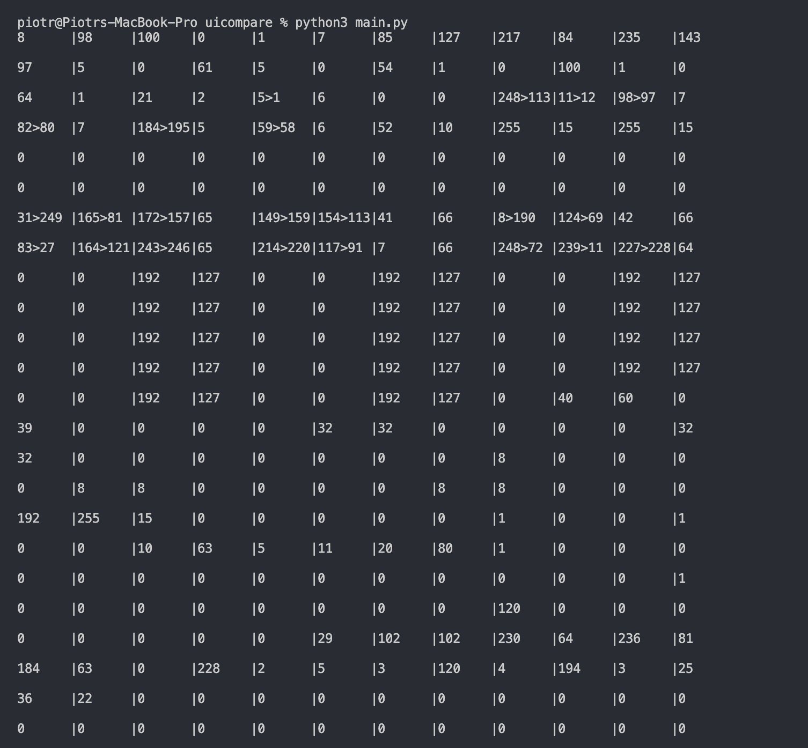

# uicomparelist
Compare Two Lists to see grid

Message1.txt - file with list of number from previous input
Message2.txt - file with list of number from current input 
main.py - file compare two list of numbers and get diff with ui on command line 

